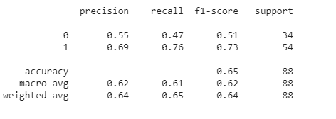

# ObituariesData

This project deals with a obituaries dataset gathered from the Daily Nation. The data is a sample of mortality in Kenya that is intended to inform the creation and marketing of various life insurance products.

## Getting Started

The notebook in this project can be used in both Jupyter Notebook on Anaconda and Google Colab. There will be a link in the repo to Colab.

## Kaplan-Meier Survival Analysis

The first objective was coming up with a Kaplan-Meier survival curve using various variables. Below is an exmaple using the deceased's gender to determine the survival probabilities of each gender.

### Survival Curve for Gender

From the graph above, we can observe that the survival rate of individuals, whose obituaries asked for fundraising, was lower than those who did not ask explicitly. This is especially evident for adults from the youth and gets worse for middle-aged adults. This may be due to poor financial planning when it comes to the event of death. Most people do not account for this and most families or involved members must fundraise to cover costs of burial, upkeep of the household and even to pay debts.

## Model to predict those who need fundraising

The second objective is to create and train a model that can predict who needs fundraising based on the dataset provided. This will also inform us on who needs life insurance the most.

### Algorithms used
Since this is a classification problem, all the algorithms used are classifiers. The top two models are:

<!-- #### Decision Trees

 -->

#### Random Forest 

First, we will look at how ensembling alogorithms will perform for this problem.

This model has a high accuracy level and sensitivity level. However, the specificity is low and can be improved.

The model can predict those who need fundraising, better than those who do not need it. There is also a high number of False Positives, meaning that it predicts that someone needs fundraising when they didn't ask for it or need it.

<!-- #### XGBoost

 -->

#### CATBoost

This is a gradient-boosting algorithm with all the hype around it. Let's see what it can do.

The accuracy and specificity are lower than Random Forest. However, the sensitivity is higher. 

The model, also predicts those who need fundraising, better than those who don't. It also has a higher number of False Positives, compared to Random Forest

## Conclusion

* Random Forest, in this case, is the better model for the job from my analysis.
* However, we can still improve the model by engaging in a more extensive and thorough feature engineering and hyperparameter tuning.
* The data was riddled with a lot of null values for valuable information like age, number of children .etc. Therefore, the data gathering and engineering processes much be improved to get better insights from the data
